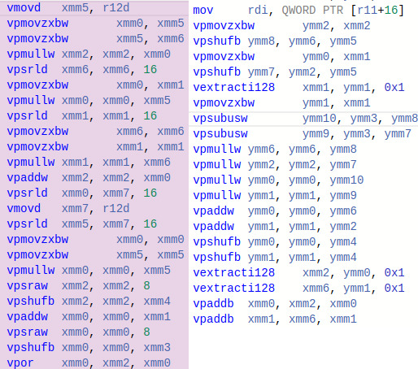

# Альфа блендинг
Работа, созданная в качестве задачи учебного курса Дединского Ильи Рудольфовича.


## Цели
Познакомится с методами оптимизации. Изучение SIMD инструкций.


## Программа
Данная программа совмещает две картинки .bmp формата любого размера, но при этом фоновая картинка должна быть по ширине и высоте чем передняя картинка. Также можно задать смещение передней картинки по левому верхнему углу, где она будет отрисована относительно фоновой.


При запуске введите путь к фоновой картинке, путь к передней картинке, путь к файлу с результатом, пару x, y - смещение передней картинки.
После выполнения альфа-блендинга в окне вы увидите результат работы совмещения.


## Оптимизация
Ускорение времени работы программы удалось достичь благодаря векторным инструкциям AVX2. В отличие от простой реализации, где за один раз рассчитывался один пиксель, в оптимизированной версии за раз обрабатывалось уже восемь пикселей. 


Рассмотрим различия между оптимизированной и наивной реализацией алгоритма вычисления. Обе программы были скомпилированы с флагом -O2.


Рассмотрим фрагменты кода:
``` C
front_pixel.rgbAlpha = (uint8_t) ((alpha * front_pixel.rgbAlpha + (255 - alpha) * back_pixel.rgbAlpha) >> 8);
front_pixel.rgbGreen = (uint8_t) ((alpha * front_pixel.rgbGreen + (255 - alpha) * back_pixel.rgbGreen) >> 8);
front_pixel.rgbBlue  = (uint8_t) ((alpha * front_pixel.rgbBlue  + (255 - alpha) * back_pixel.rgbBlue ) >> 8);
front_pixel.rgbRed   = (uint8_t) ((alpha * front_pixel.rgbRed   + (255 - alpha) * back_pixel.rgbRed  ) >> 8);
```

``` C
__m256i front = _mm256_load_si256((__m256i*) (front_img->pixel_data + front_it));
__m256i back  = _mm256_load_si256((__m256i*) (back_img->pixel_data  + back_it));


__m256i front_l = _mm256_cvtepu8_epi16(_mm256_extracti128_si256(front, 0));
__m256i back_l  = _mm256_cvtepu8_epi16(_mm256_extracti128_si256(back, 0));


front_l = _mm256_mullo_epi16(front_l, alpha_l);
back_l  = _mm256_mullo_epi16(back_l, _mm256_subs_epu16(_mm256_set1_epi16(Max_aplha), alpha_l));


__m256i sum_l = _mm256_add_epi16(front_l, back_l);
```


Сверху представлен код в наивной реализации, снизу - оптимизированной.
Оба этих блока в программе рассчитывают значения цветов пикселей с учетом яркости передней картинки.


Снизу представлены ассемблерный код данных фрагментов после реверстки (источник: [Godbolt](https://godbolt.org/)).
Слева - наивная реализация, справа - с использованием SIMD команд.


;


Из этого небольшого фрагмента видно, что возможности компилятора с флагом -O2 уже воспользовались xmm регистрами. Однако использование SIMD команд напрямую ускоряет программу, так как, во-первых, можем обрабатывать по восемь пикселей за раз, во-вторых, уменьшилось общее количество тактов.


## Сравнение


Для расчета времени работы была взята картинка 512 * 340 пикселей.
Замер происходил при полной зарядке ноутбука при питание от сети.
Программа в обоих случаях скомпилирована с флагом -O2.


Картинка была пересчитана 5000. Это было сделано для более точного замера времени выполнения альфа-блендинга.


В таблице представлено общее время работы альфа-блендинга.


| Версия            | Время сек.   |
| ----------------- | ------------ |
| Без  оптимизации  | 3.138        |
| AVX2 оптимизации  | 0,428        |


## Вывод
Из представленных результатов видно, что благодаря использованию AVX2 команд получилось достигнуть ускорения программы в 7.3 раз.
